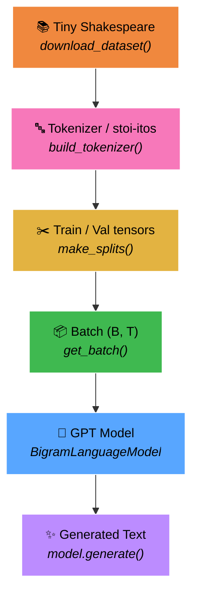
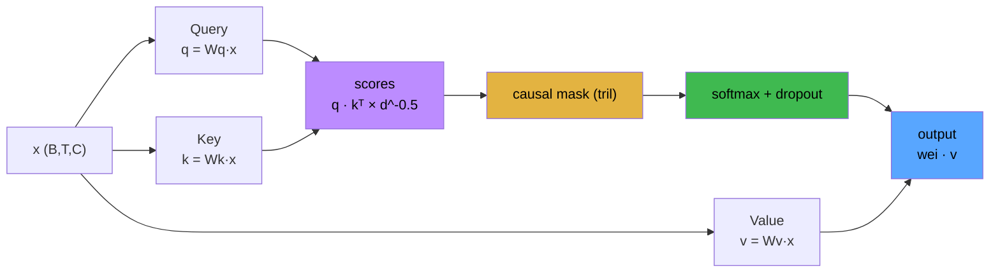
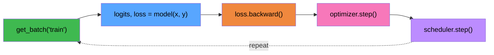
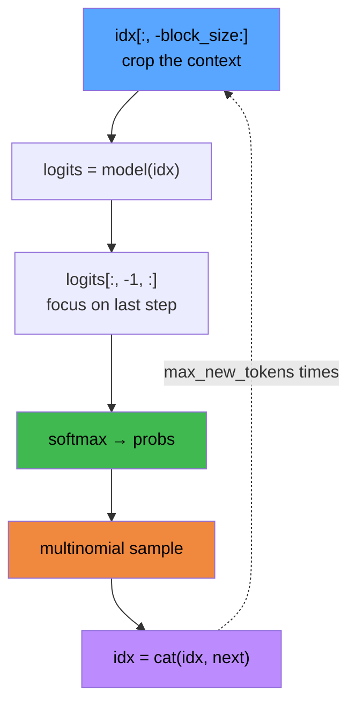

<div align="center">

# 🧠 nano-gpt

### A Character-Level GPT (Transformer) From Scratch

A faithful, heavily-commented PyTorch implementation of Andrej Karpathy's **"Let's build GPT"** lecture.
Every part of a decoder-only Transformer: token & position embeddings, causal self-attention, multi-head, residual blocks and autoregressive text generation.


<a href="https://colab.research.google.com/github/gocenalper/nano-gpt/blob/main/gpt_scratch.ipynb" target="_parent"></a>

📄 **[Detailed visual documentation (PDF) →](docs/nano-gpt-documentation.pdf)**

</div>

---

## 📑 Table of Contents

- [About](#-about)
- [Quick Start](#-quick-start)
- [End-to-End Flow](#-end-to-end-flow)
- [Architecture](#-architecture)
  - [Self-Attention Head](#self-attention-head)
  - [Transformer Block](#transformer-block)
  - [BigramLanguageModel](#bigramlanguagemodel)
- [Data Layer](#-data-layer)
- [Training](#-training)
- [Text Generation](#-text-generation)
- [Results & Limitations](#-results--limitations)
- [Hyperparameters](#-hyperparameters)
- [Documentation PDF](#-documentation-pdf)
- [Project Structure](#-project-structure)
- [Acknowledgements](#-acknowledgements)

---

## 🎯 About

This repo demonstrates the core architecture of modern large language models (GPT) in the **simplest possible form**. Apart from scale, the fundamental mechanism is identical:

> **token + position embedding → causal self-attention → multi-head → residual blocks → autoregressive generation**

That makes it an ideal starting point for learning "GPT from scratch". All the code lives in a single notebook (`gpt_scratch.ipynb`), with every line explained through inline comments.

**Highlights:**

- ✅ Character-level tokenizer (no BPE, vocab ≈ 65 → easy debugging)
- ✅ Self-attention & multi-head built from scratch in pure PyTorch
- ✅ Transformer blocks with Pre-LayerNorm + residual connections
- ✅ Regularization with dropout
- ✅ AdamW + **Cosine Annealing** learning-rate scheduler
- ✅ **Early Stopping** to guard against overfitting
- ✅ Live experiment tracking with **Weights & Biases**

---

## 🚀 Quick Start

```bash
# 1) Clone the repository
git clone https://github.com/gocenalper/nano-gpt.git
cd nano-gpt

# 2) Install dependencies
pip install torch wandb

# 3) Open the notebook and run the cells in order
jupyter notebook gpt_scratch.ipynb
```

> 💡 The dataset (`data/input.txt`) is downloaded automatically on first run.
> Training runs on `cuda` automatically if a GPU is available.

Alternatively, use the **"Open In Colab"** badge above to run it straight in the browser (with a GPU).

---

## 🔄 End-to-End Flow

The full pipeline, from raw text to freshly generated text. Each box maps to a function in the notebook.



| Stage | Function | Description |
|-------|-----------|----------|
| 1. Download | `download_dataset()` | Downloads ~1.1 MB of raw text from Karpathy's char-rnn repo. |
| 2. Tokenize | `build_tokenizer()` | Maps every unique character to an integer (`encode` / `decode`). |
| 3. Split | `make_splits()` | Converts text to a single `long` tensor, 90% train / 10% val. |
| 4. Batch | `get_batch()` | Pulls `(context, target)` pairs from random starting points. |
| 5. Model | `BigramLanguageModel` | Embedding → N× Transformer Block → LayerNorm → `lm_head`. |
| 6. Generate | `model.generate()` | Autoregressive sampling, character by character. |

---

## 🏗️ Architecture

### Self-Attention Head

Each head splits the input into three projections: **Query**, **Key**, **Value**. Scores are scaled, the future is hidden with a causal mask, softmax turns them into weights, and the Values are summed.



**Causal mask** — a token may only see itself and the past (future = `-∞`):

```
        attended →
        t0  t1  t2  t3  t4
   t0 [  1   0   0   0   0 ]
   t1 [  1   1   0   0   0 ]
   t2 [  1   1   1   0   0 ]
   t3 [  1   1   1   1   0 ]
   t4 [  1   1   1   1   1 ]
```

```python
class Head(nn.Module):
    """ A single self-attention head """
    def forward(self, x):
        B, T, C = x.shape
        k = self.key(x)
        q = self.query(x)
        wei = q @ k.transpose(-2, -1) * (self.head_size**-0.5)        # scaled scores
        wei = wei.masked_fill(self.tril[:T, :T] == 0, float('-inf'))  # causal
        wei = F.softmax(wei, dim=-1)
        wei = self.dropout(wei)
        v = self.value(x)
        return wei @ v
```

### Transformer Block

Two sub-layers: **Multi-Head Self-Attention** (communicate) and **Feed-Forward** (compute). Both use **Pre-LayerNorm** and a **residual** connection:

```
x = x + Dropout( MultiHeadAttention( LayerNorm(x) ) )
x = x + Dropout( FeedForward( LayerNorm(x) ) )
```


### BigramLanguageModel

High-level forward pass:


| Component | Role |
|---------|--------|
| `token_embedding_table` | Maps each token id to an `n_embed`-dim vector. |
| `position_embedding_table` | Assigns a vector to each position (0…block_size). |
| `blocks` | `n_layer` Transformer blocks (Sequential). |
| `ln_f` | Final LayerNorm. |
| `lm_head` | `n_embed → vocab_size` projection (logits). |

---

## 🗂️ Data Layer

**Tokenizer** — character-level, bidirectional mapping:

```
"Hi!"  --encode-->  [20, 47, 2]  --decode-->  "Hi!"
```

**get_batch** — a `block_size`-long `x` slice is paired with `y`, shifted one to the right. A single slice carries `T` independent `(context, target)` examples:

```
x :  F  i  r  s  t     C
     ↓  ↓  ↓  ↓  ↓  ↓  ↓
y :  i  r  s  t     C  i
```

**Tensor shapes:**

| Tensor | Shape | Note |
|--------|-------|-----|
| `x`, `y` | `(B, T)` | B = batch_size, T = block_size |
| `token_embedding` | `(B, T, C)` | C = n_embed |
| `logits` | `(B, T, vocab_size)` | score for each position |
| `loss` | scalar | cross-entropy |

---

## 🎓 Training

A single iteration loop:



**Regularization & monitoring:**

- 🔍 **`estimate_loss`** — estimates train/val loss in eval mode every 500 steps.
- 🛑 **Early Stopping** — training stops if val loss stalls for 5 evaluations.
- 📉 **Cosine Annealing LR** — learning rate decays smoothly `5e-4 → 1e-5`.
- 📊 **Weights & Biases** — `train_loss`, `val_loss`, `learning_rate` logged live.

---

## ✨ Text Generation

`model.generate()` runs autoregressively — at each step it takes the last `block_size` tokens as context, samples from the last position's probability distribution and appends it:



```python
context = torch.zeros((1, 1), dtype=torch.long, device=DEVICE)
print(decode(model.generate(context, max_new_tokens=500)[0].tolist()))
```

---

## 📊 Results & Limitations

> ⚠️ **A note on numbers:** the notebook ships **without stored run outputs**, so the figures
> below are **reference values from Karpathy's lecture** for the same character-level Tiny
> Shakespeare setup — they are benchmarks to expect, not logs measured from this exact run.
> Your own numbers will vary slightly with seed, hardware and run length.

### Loss comparison

Validation loss is cross-entropy (negative log-likelihood) — **lower is better**:

| Model | Val loss (ref.) | Why |
|-------|:---------------:|-----|
| Random initialization | ≈ **4.17** | `ln(65)` — pure chance over 65 characters |
| Pure bigram baseline | ≈ **2.50** | conditions on a single previous character → hits a floor |
| This Transformer | ≈ **1.50** | 256-char context via self-attention (lecture's scaled run reaches ≈ 1.48) |

```
Validation loss (lower is better)
Random init      ████████████████████████████████████  4.17
Pure bigram      ██████████████████████                2.50
This Transformer █████████████                         1.50
```

### Qualitative output

- **Pure bigram** → letter-soup that respects single-character frequencies but never forms real words.
- **This Transformer** → Shakespeare-*looking* text: plausible words, character names and `NAME:` dialogue structure, line breaks and punctuation. It is stylistically convincing but semantically nonsensical — expected for a ~10M-parameter character model.

### Why the (pure) bigram model is fundamentally limited

The class is named `BigramLanguageModel` — a leftover from the **starting point** of Karpathy's lecture — but the code in this repo is actually a **full decoder-only Transformer**. The "bigram" is the bare-bones baseline it grew out of, and understanding *its* ceiling is the whole motivation for attention:

1. **Context window of exactly one token.** A true bigram models `P(next char | previous char)`. It has no memory of anything before the immediately preceding character, so it cannot learn words, let alone sentences.
2. **No notion of position or order.** Without position embeddings, *where* a token sits in the sequence is invisible.
3. **It is just a lookup table.** A pure bigram is a `vocab × vocab` matrix — no hidden layers, no composition, no non-linear computation. Capacity is structurally capped.
4. **The loss plateaus (~2.5).** Single-character context is information-theoretically insufficient for English/Shakespeare, so training saturates well above the Transformer's floor no matter how long you train.

### How the Transformer breaks through that ceiling

| Addition | Limitation it removes |
|----------|-----------------------|
| **Self-attention** | gives each token a *variable* context up to `block_size` (256 chars) instead of 1 |
| **Position embeddings** | makes order/position meaningful |
| **Multi-head attention** | learns several relationship types in parallel |
| **Residual blocks + FFN** | adds depth and non-linear computation for compositional structure |

The combined effect drops validation loss from ~2.5 down to ~1.5 and turns gibberish into coherent, Shakespeare-style prose — which is exactly the leap this project is meant to demonstrate.

---

## ⚙️ Hyperparameters

The **HERO RUN v4** configuration from the notebook:

| Parameter | Value | Description |
|-----------|-------|----------|
| `block_size` | `256` | Context length |
| `batch_size` | `64` | Number of parallel sequences |
| `n_embed` | `256` | Embedding / model dimension |
| `n_head` | `8` | Number of attention heads |
| `n_layer` | `6` | Number of Transformer blocks |
| `dropout_rate` | `0.2` | Dropout rate |
| `lr` | `5e-4` | Initial learning rate |
| `epochs` | `10000` | Maximum iterations |
| `weight_decay` | `1e-3` | AdamW weight decay |

---

## 📄 Documentation PDF

A multi-page, print-ready PDF that explains the whole architecture with visual diagrams can be generated:

```bash
pip install matplotlib
python docs/generate_pdf.py
# → docs/nano-gpt-documentation.pdf
```

The PDF is drawn entirely as vectors using only `matplotlib` (no code execution required); it covers the cover page, pipeline, data layer, architecture diagrams, the attention mechanism, the training loop and the generation steps.

---

## 📁 Project Structure

```
nano-gpt/
├── gpt_scratch.ipynb              # Main notebook (model + training + generation)
├── README.md                      # This file
├── docs/
│   ├── generate_pdf.py            # Visual documentation PDF generator
│   └── nano-gpt-documentation.pdf # Generated PDF
└── data/
    └── input.txt                  # Tiny Shakespeare (downloaded automatically)
```

---

## 🙏 Acknowledgements

- **[Andrej Karpathy](https://github.com/karpathy)** — the original [nanoGPT](https://github.com/karpathy/nanoGPT) and the "Let's build GPT" lecture.
- **Tiny Shakespeare** dataset — the [char-rnn](https://github.com/karpathy/char-rnn) repo.
- *"Attention Is All You Need"* — Vaswani et al., 2017.

<div align="center">

---

⭐ If you find this useful, don't forget to star the repo!

</div>
