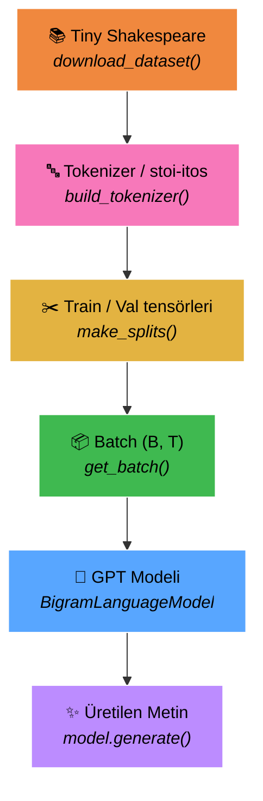
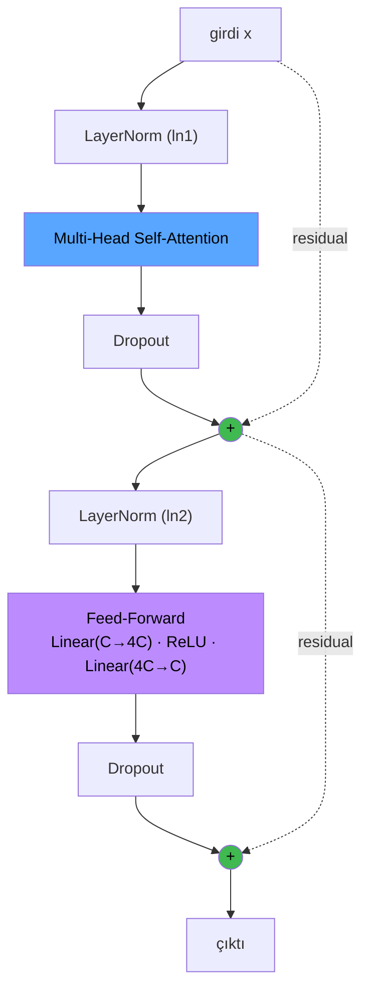
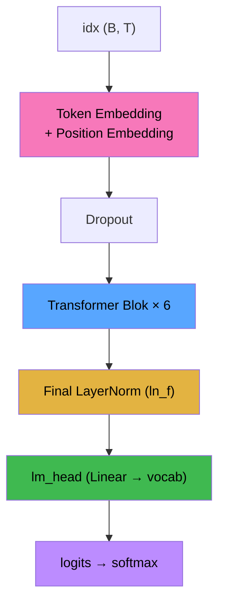
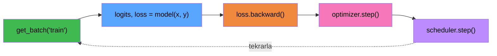
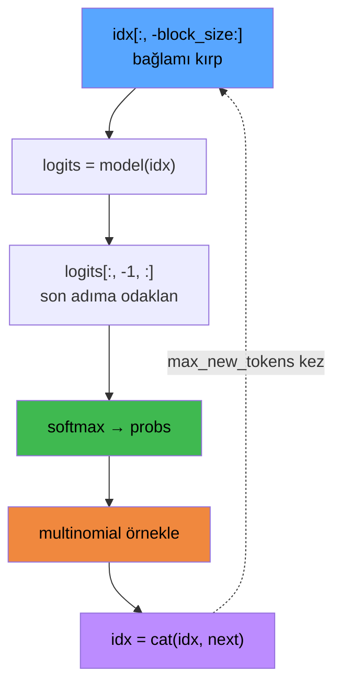

<div align="center">

# 🧠 nano-gpt

### Sıfırdan Karakter Seviyeli GPT (Transformer)

Andrej Karpathy'nin **"Let's build GPT"** dersinin PyTorch ile birebir, bol **Türkçe yorumlu** uygulaması.
Bir decoder-only Transformer'ın tüm parçaları: token & pozisyon gömme, causal self-attention, multi-head, residual bloklar ve otoregresif metin üretimi.


<a href="https://colab.research.google.com/github/gocenalper/nano-gpt/blob/main/gpt_scratch.ipynb" target="_parent"></a>

📄 **[Detaylı görsel dokümantasyon (PDF) →](docs/nano-gpt-dokumantasyon.pdf)**

</div>

---

## 📑 İçindekiler

- [Proje Hakkında](#-proje-hakkında)
- [Hızlı Başlangıç](#-hızlı-başlangıç)
- [Uçtan Uca Akış](#-uçtan-uca-akış)
- [Mimari](#-mimari)
  - [Self-Attention Head](#self-attention-head)
  - [Transformer Bloğu](#transformer-bloğu)
  - [BigramLanguageModel](#bigramlanguagemodel)
- [Veri Katmanı](#-veri-katmanı)
- [Eğitim](#-eğitim)
- [Metin Üretimi](#-metin-üretimi)
- [Hiperparametreler](#-hiperparametreler)
- [Dokümantasyon PDF'i](#-dokümantasyon-pdfi)
- [Proje Yapısı](#-proje-yapısı)
- [Teşekkür](#-teşekkür)

---

## 🎯 Proje Hakkında

Bu repo, modern büyük dil modellerinin (GPT) çekirdek mimarisini **olabilecek en sade hâliyle** gösterir. Ölçek dışında temel mekanizma aynıdır:

> **token + pozisyon gömme → causal self-attention → multi-head → residual bloklar → otoregresif üretim**

Bu yüzden "sıfırdan GPT" öğrenmek için ideal bir başlangıç noktasıdır. Tüm kod tek bir notebook'ta (`gpt_scratch.ipynb`), her satırı Türkçe yorumlarla açıklanmış olarak bulunur.

**Öne çıkan özellikler:**

- ✅ Karakter seviyeli tokenizer (BPE yok, vocab ≈ 65 → kolay hata ayıklama)
- ✅ Saf PyTorch ile sıfırdan self-attention & multi-head
- ✅ Pre-LayerNorm + residual bağlantılı Transformer blokları
- ✅ Dropout ile düzenlileştirme
- ✅ AdamW + **Cosine Annealing** öğrenme oranı planlayıcısı
- ✅ **Early Stopping** ile aşırı öğrenme koruması
- ✅ **Weights & Biases** ile canlı deney takibi

---

## 🚀 Hızlı Başlangıç

```bash
# 1) Depoyu klonla
git clone https://github.com/gocenalper/nano-gpt.git
cd nano-gpt

# 2) Bağımlılıkları kur
pip install torch wandb

# 3) Notebook'u aç ve hücreleri sırayla çalıştır
jupyter notebook gpt_scratch.ipynb
```

> 💡 Veri kümesi (`data/input.txt`) ilk çalıştırmada otomatik indirilir.
> GPU varsa eğitim otomatik olarak `cuda` üzerinde çalışır.

Alternatif olarak yukarıdaki **"Open In Colab"** rozetiyle doğrudan tarayıcıda (GPU ile) çalıştırabilirsiniz.

---

## 🔄 Uçtan Uca Akış

Ham metinden üretilen yeni metne kadar tüm boru hattı. Her kutu, notebook'taki bir fonksiyona karşılık gelir.



| Aşama | Fonksiyon | Açıklama |
|-------|-----------|----------|
| 1. İndirme | `download_dataset()` | Karpathy'nin char-rnn deposundan ~1.1 MB ham metin indirir. |
| 2. Tokenizasyon | `build_tokenizer()` | Her benzersiz karakter bir tam sayıya eşlenir (`encode` / `decode`). |
| 3. Bölme | `make_splits()` | Metin tek bir `long` tensöre çevrilir, %90 train / %10 val. |
| 4. Batch | `get_batch()` | Rastgele başlangıçlardan `(context, hedef)` çiftleri çekilir. |
| 5. Model | `BigramLanguageModel` | Embedding → N× Transformer Blok → LayerNorm → `lm_head`. |
| 6. Üretim | `model.generate()` | Otoregresif örnekleme ile karakter karakter yeni metin. |

---

## 🏗️ Mimari

### Self-Attention Head

Her head, girdiyi üç projeksiyona ayırır: **Query**, **Key**, **Value**. Skorlar ölçeklenir, causal mask ile gelecek maskelenir, softmax ile ağırlığa çevrilir ve Value'lar toplanır.


**Causal mask** — bir token yalnızca kendisini ve geçmişi görebilir (gelecek = `-∞`):

```
        bakılan →
        t0  t1  t2  t3  t4
   t0 [  1   0   0   0   0 ]
   t1 [  1   1   0   0   0 ]
   t2 [  1   1   1   0   0 ]
   t3 [  1   1   1   1   0 ]
   t4 [  1   1   1   1   1 ]
```

```python
class Head(nn.Module):
    """ Bir tane self-attention head """
    def forward(self, x):
        B, T, C = x.shape
        k = self.key(x)
        q = self.query(x)
        wei = q @ k.transpose(-2, -1) * (self.head_size**-0.5)        # ölçekli skor
        wei = wei.masked_fill(self.tril[:T, :T] == 0, float('-inf'))  # causal
        wei = F.softmax(wei, dim=-1)
        wei = self.dropout(wei)
        v = self.value(x)
        return wei @ v
```

### Transformer Bloğu

İki alt-katman: **Multi-Head Self-Attention** (haberleşme) ve **Feed-Forward** (hesaplama). Her ikisinde **Pre-LayerNorm** ve **residual** bağlantı uygulanır:

```
x = x + Dropout( MultiHeadAttention( LayerNorm(x) ) )
x = x + Dropout( FeedForward( LayerNorm(x) ) )
```



### BigramLanguageModel

Üst düzey ileri geçiş:



| Bileşen | Görevi |
|---------|--------|
| `token_embedding_table` | Her token id'sini `n_embed` boyutlu vektöre çevirir. |
| `position_embedding_table` | Her pozisyona (0…block_size) bir vektör atar. |
| `blocks` | `n_layer` adet Transformer bloğu (Sequential). |
| `ln_f` | Final LayerNorm. |
| `lm_head` | `n_embed → vocab_size` projeksiyonu (logitler). |

---

## 🗂️ Veri Katmanı

**Tokenizer** — karakter seviyeli, çift yönlü eşleme:

```
"Hi!"  --encode-->  [20, 47, 2]  --decode-->  "Hi!"
```

**get_batch** — `block_size` uzunluğundaki `x` dilimi, 1 sağa kaymış `y` ile eşleşir. Tek dilim, `T` adet bağımsız `(context, hedef)` örneği taşır:

```
x :  F  i  r  s  t     C
     ↓  ↓  ↓  ↓  ↓  ↓  ↓
y :  i  r  s  t     C  i
```

**Tensör şekilleri:**

| Tensör | Şekil | Not |
|--------|-------|-----|
| `x`, `y` | `(B, T)` | B = batch_size, T = block_size |
| `token_embedding` | `(B, T, C)` | C = n_embed |
| `logits` | `(B, T, vocab_size)` | her pozisyon için skor |
| `loss` | skaler | cross-entropy |

---

## 🎓 Eğitim

Tek bir iterasyon döngüsü:



**Düzenlileştirme & izleme:**

- 🔍 **`estimate_loss`** — her 500 adımda eval modunda train/val loss tahmini.
- 🛑 **Early Stopping** — val loss 5 değerlendirme boyunca düşmezse eğitim durur.
- 📉 **Cosine Annealing LR** — öğrenme oranı `5e-4 → 1e-5` yumuşakça azalır.
- 📊 **Weights & Biases** — `train_loss`, `val_loss`, `learning_rate` canlı loglanır.

---

## ✨ Metin Üretimi

`model.generate()` otoregresif çalışır — her adımda son `block_size` token'ı bağlam alır, son pozisyonun olasılık dağılımından örnekler ve diziye ekler:



```python
context = torch.zeros((1, 1), dtype=torch.long, device=DEVICE)
print(decode(model.generate(context, max_new_tokens=500)[0].tolist()))
```

---

## ⚙️ Hiperparametreler

Notebook'taki **HERO RUN v4** konfigürasyonu:

| Parametre | Değer | Açıklama |
|-----------|-------|----------|
| `block_size` | `256` | Bağlam (context) uzunluğu |
| `batch_size` | `64` | Paralel dizi sayısı |
| `n_embed` | `256` | Gömme / model boyutu |
| `n_head` | `8` | Attention head sayısı |
| `n_layer` | `6` | Transformer blok sayısı |
| `dropout_rate` | `0.2` | Dropout oranı |
| `lr` | `5e-4` | Başlangıç öğrenme oranı |
| `epochs` | `10000` | Maksimum iterasyon |
| `weight_decay` | `1e-3` | AdamW ağırlık çürümesi |

---

## 📄 Dokümantasyon PDF'i

Tüm mimariyi görsel diyagramlarla anlatan, baskıya uygun çok sayfalı bir PDF üretilebilir:

```bash
pip install matplotlib
python docs/generate_pdf.py
# → docs/nano-gpt-dokumantasyon.pdf
```

PDF, kod gerektirmeden (yalnızca `matplotlib`) tamamen vektörel olarak çizilir; kapak, akış şeması, mimari diyagramları, attention mekanizması, eğitim döngüsü ve üretim adımlarını içerir.

---

## 📁 Proje Yapısı

```
nano-gpt/
├── gpt_scratch.ipynb              # Ana notebook (model + eğitim + üretim)
├── README.md                      # Bu dosya
├── docs/
│   ├── generate_pdf.py            # Görsel dokümantasyon PDF üreteci
│   └── nano-gpt-dokumantasyon.pdf # Üretilen PDF
└── data/
    └── input.txt                  # Tiny Shakespeare (otomatik indirilir)
```

---

## 🙏 Teşekkür

- **[Andrej Karpathy](https://github.com/karpathy)** — orijinal [nanoGPT](https://github.com/karpathy/nanoGPT) ve "Let's build GPT" dersi.
- **Tiny Shakespeare** veri kümesi — [char-rnn](https://github.com/karpathy/char-rnn) deposu.
- *"Attention Is All You Need"* — Vaswani et al., 2017.

<div align="center">

---

⭐ Faydalı bulduysanız repoyu yıldızlamayı unutmayın!

</div>
